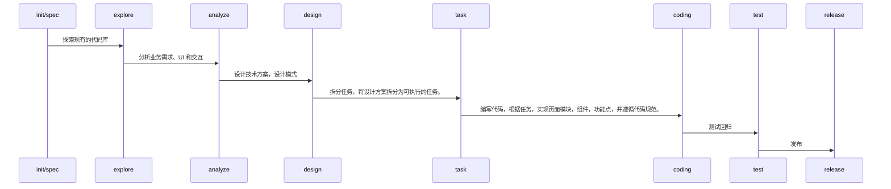

# An SDD- and AC-Based R&D Paradigm

## 研发方向

针对当前司机端的项目历史背景，以及迭代流程，现阶段的研发大致可以划分三个方向：

1）历史项目的日常迭代

- 理解存量代码库
- 需求分析：分析业务逻辑
- 技术设计 & UI 设计
- Coding 研发
- 测试回归
- 发布

2）历史项目的版本升级

- 理解存量代码库
- 需求分析：梳理重构方案
- 技术设计 & UI 设计
- Coding 研发
- 测试回归
- 发布

3）新起项目的需求研发

- 梳理业务需求逻辑
- 技术方案设计
- UI 设计
- Coding 研发
- 测试回归
- 发布

## 流程阶段

- init/spec：建立规范体系的认知
- explore（optional）：探索现有的代码库
- analyze：分析业务需求、UI 和交互
- design：设计技术方案，设计模式
- task：拆分任务，将设计方案拆分为可执行的任务。
- coding：编写代码，根据任务，实现页面模块，组件，功能点，并遵循代码规范。

### Explore

借助 Claude Code 新的 Explore

探索现有的代码库

### Init

初始化项目的规范，例如：确定目录结构，技术框架，依赖库，项目配置等。

### Design

设计项目的技术方案， UI 和交互

### Task

拆分任务，将设计方案拆分为可执行的任务。

### Coding

编写代码，根据任务，实现页面模块，组件，功能点，并遵循代码规范。

| Process       | Input                                                    | Output | Key Differences |
| ------------- | -------------------------------------------------------- | ------ | --------------- |
| 理解 Codebase | Codebase、wiki                                           |        |                 |
| 需求分析      | prd、UI/UE、API、testcases                               |        |                 |
| 技术设计      | 需求分析输出、现有系统架构图                             |        |                 |
| 任务拆分      | 任务拆分清单                                             |        |                 |
| 编写代码      | 代码模板/脚手架                                          |        |                 |
| 测试回归      | 测试用例大纲、开发自测报告、接口文档、代码影响面分析报告 |        |                 |
| 发布          | 测试报告、发布方案、回滚方案                             |        |                 |



## 目录

```
.h5spec
├── scripts
├── specs
└── templates
```
