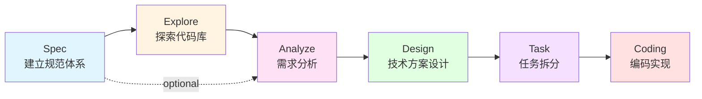
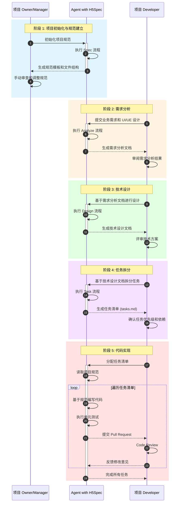

# An SDD- and AC-Based R&D Paradigm

## 术语

SDD - Software Design Document
AC - Agentic Coding

## 适用场景

针对当前司机端的项目历史背景，以及迭代流程，现阶段的研发场景大致可以划分三个方向：

### 1. 历史项目的日常迭代

- 理解存量代码库
- 需求分析
- 技术设计 & UI 设计
- Coding 研发
- 测试回归
- 发布

### 2. 历史项目的重构升级

- 理解存量代码库
- 梳理重构方案
- 技术设计 & UI 设计
- Coding 研发
- 测试回归
- 发布

### 3. 新起项目的需求研发

- 梳理业务需求逻辑
- 技术方案设计
- UI 设计
- Coding 研发
- 测试回归
- 发布

## 流程阶段

### cli 脚手架初始化项目模板

```bash
h5spec init
```

### slash command 开启项目



### 阶段概览

- **Spec**：建立规范体系的认知，定义项目标准和开发规范
- **Explore**（可选）：探索现有的代码库，理解系统架构和技术债务
- **Analyze**：分析业务需求、UI 和交互设计
- **Design**：设计技术方案、系统架构和设计模式
- **Task**：拆分任务，将技术方案拆分为可执行的开发任务
- **Coding**：编写代码，实现页面模块、组件、功能点，并遵循代码规范

---

### Spec

example:

```bash
/h5spec:spec
```

output:

```bash
docs/SPEC.md 项目规范文档
file-system-structure.md 文件系统结构文档
# docs/adr/ 技术决策记录（ADR - Architecture Decision Records）目录
```

**目标**: 建立项目的规范体系和技术标准

**核心内容**:

- **目录结构规范**: 遵循业界最佳实践（如 Feature-Sliced Design、Atomic Design）
- **技术框架选型**: 基于项目需求选择合适的框架和库
- **代码规范**: ESLint、Prettier、StyleLint 等工具配置
- **Git 工作流**: 定义分支策略、提交规范（Conventional Commits）
- **CI/CD 流程**: 自动化测试、构建、部署流程

**业界标准**:

- **Airbnb JavaScript Style Guide**: 最流行的 JavaScript 代码规范之一
- **Google Style Guides**: Google 的多语言代码规范，涵盖 Java、Python、C++ 等
- **Feature-Sliced Design (FSD)**: 现代前端架构设计方法论，被众多大型前端项目采用
- **Conventional Commits**: 语义化提交规范，被 Angular、Vue.js 等项目使用

**输出物**:

- CLAUDE.md / PROJECT_SPEC.md 项目规范文档
- .editorconfig、.eslintrc、.prettierrc 等配置文件
- 技术决策记录（ADR - Architecture Decision Records）

### Explore

**目标**: 深入理解现有代码库的架构、技术栈和业务逻辑

**工具与方法**:

- 借助 Claude Code 的 Explore Agent 进行智能代码探索
- 使用 AST 分析工具理解代码结构和依赖关系
- 绘制系统架构图和模块依赖图

**业界实践**:

- **Sourcegraph**: 企业级代码搜索和智能导航平台，被 Uber、Dropbox 等公司用于大规模代码库探索
- **GitHub Copilot Workspace**: 基于 AI 的代码库理解工具，可以快速生成代码库概览
- **CodeSee**: 可视化代码库架构，自动生成代码地图，被众多开源项目采用

**输出物**:

- 代码库结构文档
- 技术栈清单
- 关键模块和依赖关系图
- 潜在技术债务和重构建议

### Analyze

**目标**: 深入分析业务需求、用户交互和技术可行性

**分析维度**:

1. **需求分析**

   - 功能需求梳理（Feature List）
   - 非功能需求（性能、安全、可访问性）
   - 业务流程分析（User Journey）

2. **UI/UX 分析**

   - 视觉设计稿评审
   - 交互流程分析
   - 响应式设计要求
   - 无障碍访问（a11y）要求

3. **技术可行性分析**
   - 现有技术栈的兼容性
   - 第三方依赖的可用性
   - 性能和安全风险评估

**工具与方法**:

- **PRD (Product Requirements Document)**: 产品需求文档
- **User Story**: 用户故事，描述用户需求
- **Use Case Diagram**: 用例图，展示系统功能
- **Wireframe/Mockup**: 线框图/原型图

**业界实践**:

- **Figma/Sketch**: 设计稿工具，支持开发者检查模式
- **Zeplin/Avocode**: 设计稿标注工具，自动生成样式代码
- **Storybook**: 组件开发和文档工具，可视化 UI 组件
- **User Story Mapping**: Jeff Patton 提出的需求分析方法

**输出物**:

- 需求分析文档
- 用户故事和验收标准
- UI/UX 规范文档
- 技术可行性报告

### Design

**目标**: 设计技术方案、系统架构和交互模式

**设计维度**:

1. **系统架构设计**

   - 分层架构、模块化设计
   - 数据流设计（单向数据流、状态管理）
   - API 设计（RESTful、GraphQL）

2. **UI/UX 设计**

   - 组件化设计（Atomic Design）
   - 设计系统（Design System）
   - 交互原型和用户流程

3. **性能与可扩展性**
   - 代码分割、懒加载策略
   - 缓存策略
   - 性能优化方案

**业界方案**:

- **C4 Model**: 软件架构可视化方法，分为 Context、Container、Component、Code 四层
- **Design Tokens**: Salesforce Lightning、Atlassian Design System 采用的设计变量管理方式
- **Micro-Frontends**: 类似微服务的前端架构模式，被 Spotify、IKEA 等公司采用
- **BFF (Backend for Frontend)**: Netflix、Soundcloud 使用的 API 聚合层模式

**输出物**:

- 系统架构图（C4 Model）
- 组件设计文档
- API 接口设计文档
- 数据库设计（ER 图）
- 性能优化方案

### Task

**目标**: 将设计方案拆解为可执行的开发任务

**拆分原则**:

- **SMART 原则**: 任务应该是具体（Specific）、可衡量（Measurable）、可实现（Achievable）、相关性（Relevant）、有时限（Time-bound）
- **小步快跑**: 每个任务应该能在 1-2 天内完成
- **依赖明确**: 清晰标注任务之间的依赖关系
- **可测试性**: 每个任务应该有明确的验收标准

**工具与方法**:

- **WBS (Work Breakdown Structure)**: 项目管理中的任务分解结构
- **User Story Mapping**: Agile 开发中的需求拆分方法
- **Tasks.md**: 使用 Markdown 管理任务清单，支持任务依赖和状态追踪

**业界实践**:

- **Jira/Linear**: 现代软件团队的任务管理工具
- **GitHub Issues/Projects**: 开源项目常用的任务管理方式
- **ClickUp/Notion**: 集成化的项目管理平台

**输出物**:

- tasks.md 任务清单
- 任务依赖关系图
- 开发排期表
- 里程碑计划

### Coding

**目标**: 高质量地实现功能，遵循最佳实践和代码规范

**开发原则**:

- **DRY (Don't Repeat Yourself)**: 避免代码重复
- **SOLID 原则**: 面向对象设计的五大原则
- **KISS (Keep It Simple, Stupid)**: 保持简单
- **YAGNI (You Aren't Gonna Need It)**: 不过度设计

**代码质量保障**:

- **单元测试**: Jest、Vitest、Pytest 等测试框架
- **代码审查**: Pull Request + Code Review 流程
- **静态分析**: SonarQube、CodeClimate 等代码质量分析工具
- **持续集成**: 自动化测试和构建

**AI 辅助编程**:

- **GitHub Copilot**: 全球最流行的 AI 编程助手
- **Claude Code**: 基于 Claude 的智能编程 CLI
- **Cursor**: AI-first 的代码编辑器
- **Cody (Sourcegraph)**: 企业级 AI 编程助手

**输出物**:

- 生产就绪的代码
- 单元测试和集成测试
- 代码文档和注释
- Pull Request 和 Code Review 记录

---

## 协作流程与角色交互

在 H5Spec 工作流中，有三个核心角色协同工作，共同完成从规范建立到代码实现的全过程。

### 角色定义

1. **项目 Owner/Manager** - 负责项目初始化和规范制定
2. **项目 Developer** - 负责需求分析、技术设计和任务规划
3. **Agent with H5Spec** - 集成 H5Spec 规范引擎的 AI 助手，提供标准化工作流支持和代码实现

### 协作时序图



```mermaid
 rect rgb(240, 255, 240)
        Note over PM,Dev: 阶段 6: 交付验收
        Dev->>+PM: 提交完整交付物
        PM->>PM: 验收测试
        PM-->>-Dev: 确认通过
    end
```

### 协作要点

- **项目 Owner/Manager**: 在项目初期通过 Agent with H5Spec 初始化规范和文件结构，并进行手动审查调整
- **项目 Developer**: 通过 Agent with H5Spec 完成需求分析、技术设计和任务拆分的全流程，并负责代码审查
- **Agent with H5Spec**: 集成 H5Spec 规范引擎的 AI 助手，在各阶段提供标准化工作流支持、文档生成和代码实现
